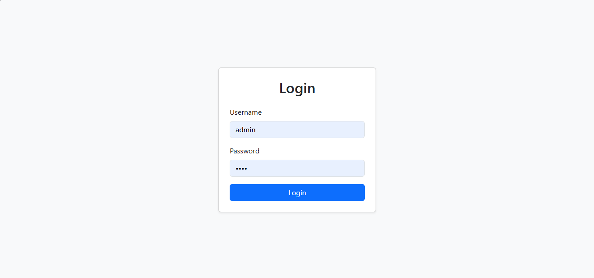
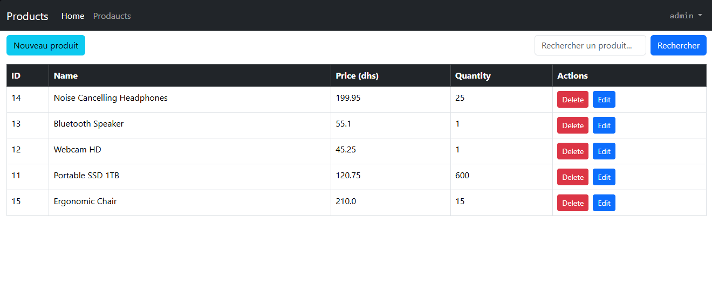
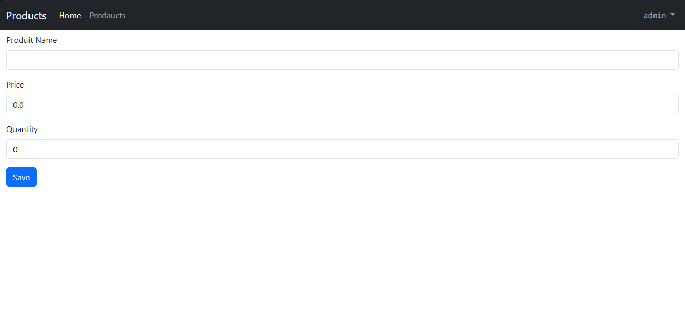
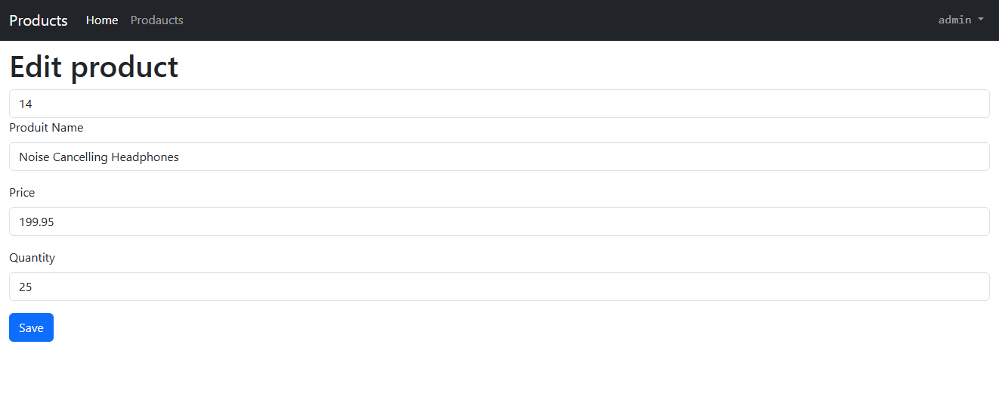

<h1>Gestion des Produits - Application Web JEE</h1>

Cette application web est développée avec **Spring Boot** et utilise les technologies suivantes : **Spring MVC**, **Spring Data JPA**, **Hibernate**, **Thymeleaf**, **Spring Security**.  
Elle permet de **gérer une liste de produits** (CRUD + recherche + sécurité), avec une interface web simple et responsive.

<h4>Technologies utilisées</h4>

- Spring Boot
- Spring Web
- Spring Data JPA
- Hibernate
- Thymeleaf
- Spring Security
- Spring Validation
- Lombok
- Base de données : postgresql

<h4>Fonctionnalités </h4>

### 🔹 CRUD Produits
- Afficher la liste des produits
- Ajouter un produit (avec validation de formulaire)
- Modifier un produit
- Supprimer un produit
- Rechercher un produit par mot-clé

### 🔹 Sécurité
- Authentification utilisateur avec Spring Security
- Désactivation temporaire de la sécurité lors du développement
- Activation de la sécurité avec gestion des accès

### 🔹 UI
- Templates Thymeleaf avec layout
- Design responsive basé sur Bootstrap

